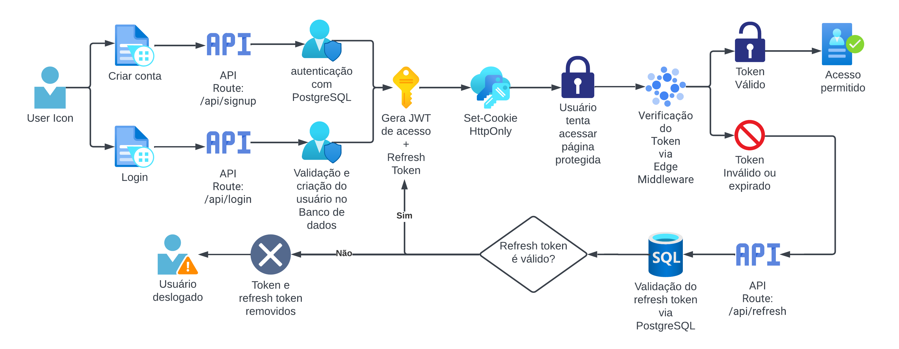

# **SIAPESQ - Eco Data - Sistema de Apoio à Pesquisa Taxonômica**

Este projeto é uma aplicação web voltada para **pesquisa e visualização de informações taxonômicas e ecológicas**, utilizando dados da **API oficial do GBIF**. A aplicação oferece um ecossistema completo de autenticação, busca, visualização de perfis biológicos, mapas de distribuição e outras funcionalidades.

Construído com **Next.js (App Router), TypeScript, Tailwind CSS, Redux Toolkit**, e integração com **JWT + Refresh Token** para autenticação segura e persistente.

---

## **Principais Funcionalidades**

- ✅ Autenticação com **JWT + Refresh Token** http only para evitar ataques XXS (Cross-Site Scripting)
- ✅ Sistema de login, logout, signup com sistema de verificação e atualização de tokens de acesso
- ✅ Rotas protegidas com renovação automática de tokens via middleware em edge, garantindo segurança e baixa latência
- ✅ Busca taxonômica utilizando a **API do GBIF**
- ✅ Exibição de **carrossel de imagens**, **mapa de distribuição de espécies** e **perfis biológicos**
- ✅ Acordeão interativo com árvore taxonômica
- ✅ Paginação com controle dinâmico de dados
- ✅ Suporte a SSR (Server-Side Rendering) e caching com revalidação
- ✅ Gerenciamento de estado com **Redux Toolkit**
- ✅ UI moderna, responsiva, customizável e acessível com **Tailwind CSS**
- ✅ Sistema de UI/UX gráfico usando toasts, loaders e animações suaves

---

## **Tecnologias Utilizadas**

- **Framework:** Next.js 14 (App Router)
- **Linguagem:** TypeScript
- **Estilização:** Tailwind CSS v4
- **Gerenciamento de estado:** Redux Toolkit + Redux Persist
- **Autenticação:** JWT + Refresh Token (via Supabase)
- **API de Dados:** GBIF Public API
- **Mapas:** Leaflet + GBIF Map Tiles
- **Banco de dados:** Supabase (PostgreSQL)
- **Outros:** jose (JWT), bcrypt, headlessui

---

## **Fluxo de autenticação**



---

## **Acessar aplicação em produção**

[Eco Data](https://eco-data-chi.vercel.app/)

---

## **Passo-a-passo para inicializar a aplicação em servidor local**

Porta: http://localhost:3000/

## **Instalação e Execução**

Siga os passos abaixo para rodar o projeto localmente:

### 1. **Clonar o repositório**

```bash
git clone https://github.com/siapesq/2025-01-desafio-front-end.git
cd 2025-01-desafio-front-end
```

### 2. **Entrar na branch de carlos-teixeira**

```bash
git checkout carlos-teixeira
```

### 2. **Instalar dependências**

```bash
npm install
```

### 2. **Criar chaves de API para o banco de dados**

[Supabase](https://supabase.com/)

### 3. **Configurar variáveis de ambiente**

Crie um arquivo `.env.local` na raiz do projeto com as seguintes variáveis:

```env
NEXT_PUBLIC_SUPABASE_URL=https://<seu-projeto>.supabase.co
NEXT_PUBLIC_SUPABASE_ANON_KEY=<sua-anon-key>
SUPABASE_SERVICE_ROLE_KEY=<sua-service-role-key>
JWT_SECRET=<uma-senha-secreta-complexa>
```

### 4. **Inicializar o projeto em servidor local**

```bash
npm run dev
```

---

### **Como usar?**

### 1. **Crie uma conta ou faça login**
- Acesse a aplicação com suas credenciais ou crie uma nova conta para começar.

### 2. **Clique em "Busca" no menu de navegação**
- Isso levará você à página principal de pesquisa taxonômica.

### 3. **Explore a busca taxonômica**
- Use o acordeão interativo clicando nas opções para navegar pelos níveis da hierarquia taxonômica — novas camadas serão exibidas conforme você avança.
- Ou pesquise diretamente no campo de busca por um termo específico.
- Os cards exibirão os resultados da busca. Clique em "Detalhes" para acessar a página da espécie selecionada.

### 4. **Visualize informações detalhadas da espécie**
- Na página de detalhes, você encontrará dados básicos sobre a espécie. Quando disponíveis, também poderá ver imagens e um mapa de distribuição global.

---

### **Contato**

Desenvolvido por [Carlos Teixeira Jr](https://github.com/Carlos-Teixeira-Jr) em 2025
Email: teixeirahist1988@gmail.com
